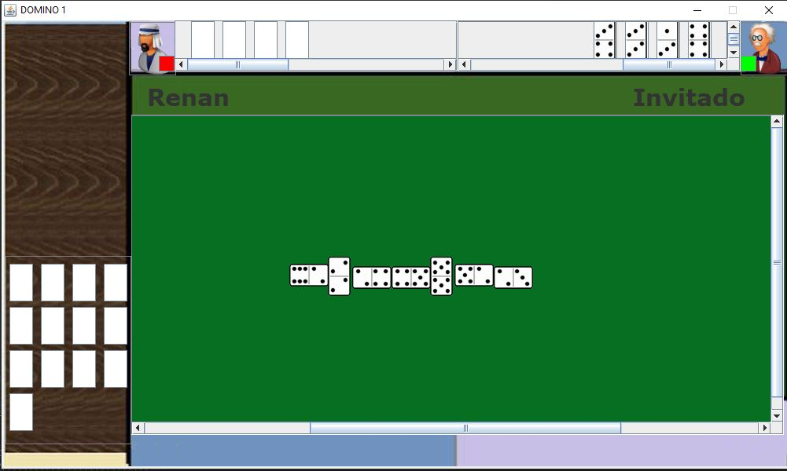
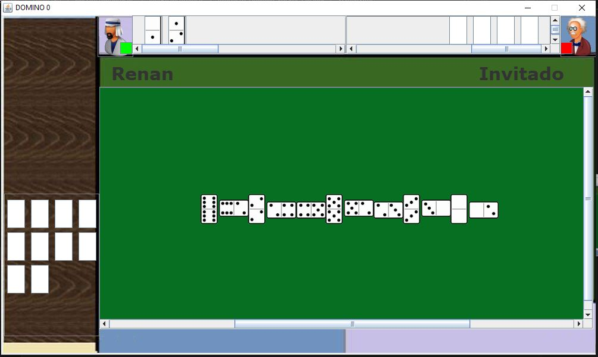
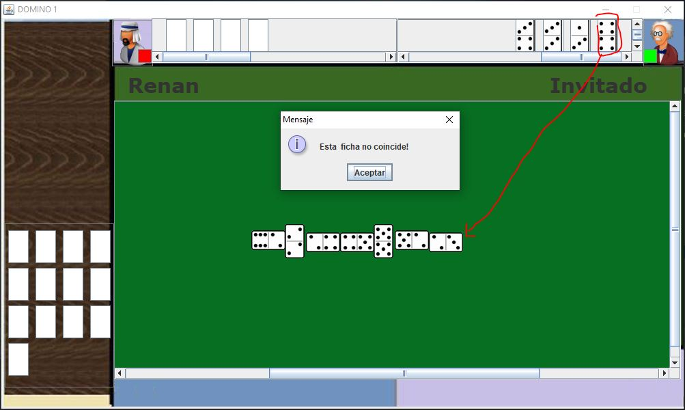

# Juego-Domino-2-Player-Socket-Java-Swing
Juego de Domino permite conectar 2 jugadores a través de la red mediante Socket Java.

  

### Iniciar Proyecto
  1.  Primero abrir el proyecto Servidor con su editor Favorito (Probado en Netbeans, Apache NetBeans, IntelliJ)
  2.  Ejeuctar el proyecto la clase principal es Servidor.java
  
         
  
  
  3.  En console se mostrara un mensaje que dice "Servidor escuchando"
  4.  Esperar a que se conecten los jugadores 1 y 2..
  5. Abrir el proyecto Cliente con su editor Favorito (Probado en Netbeans, Apache NetBeans, IntelliJ)
  6. Ejecutar la clase principal Inicio.java.
  
        
  
  8. Repetir paso 5 y 6 en la computadora del segundo jugador.

# Capturas de Pantalla

Inicio de cliente

Pantalla de espera

Aviso de turno

Tablero

Tablero de otro jugador

Validación

# Probado en Java 8 y 11

